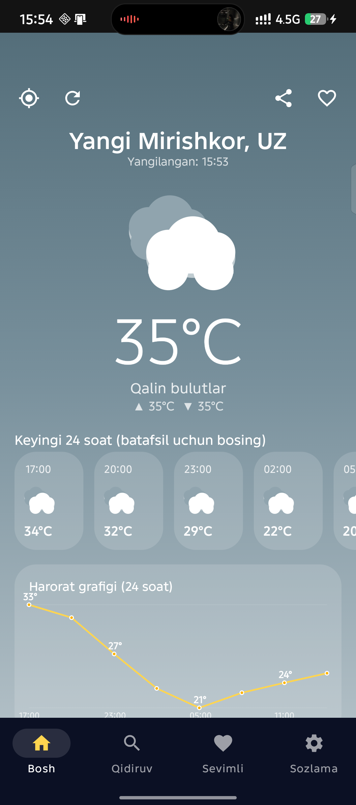
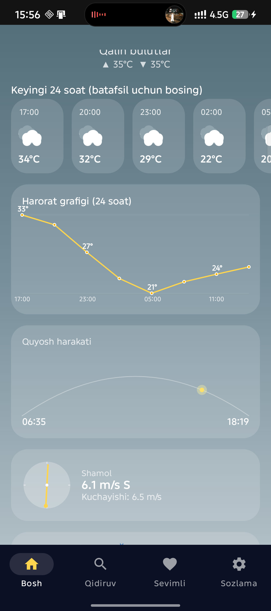
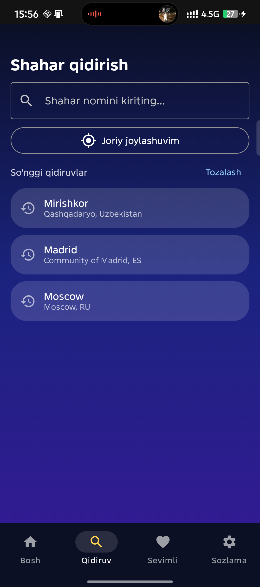
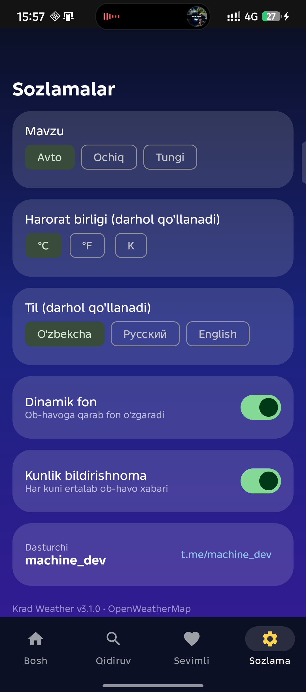

# Krad Weather ⛅

<p>
  
  
  
  
  
</p>

**Krad Weather** — Android uchun premium darajadagi ob-havo ilovasi. Ikkita API birlashgan: **OpenWeatherMap** (asosiy) + **WeatherAPI.com** (UV, rasmiy ogohlantirishlar, zaxira).

## 📱 Skrinshotlar

| Bosh ekran | Tafsilotlar |
|---|---|
|  |  |

| Qidiruv | Sozlamalar |
|---|---|
|  |  |

## ⬇️ Yuklab olish (download / clone)

```bash
# Git orqali
git clone https://github.com/nextcodeuz/kradweather.git
cd kradweather

# Yoki ZIP sifatida: GitHub sahifasida Code → Download ZIP
```

## 🚀 O'rnatish

1. Android Studio (Ladybug+) → **Open** → shu papka.
2. API kalitlarni sozlang (`local.properties` git'ga chiqmaydi):
   ```bash
   # Windows
   copy local.properties.example local.properties
   # macOS / Linux
   cp local.properties.example local.properties
   ```
   va o'z kalitlaringizni yozing:
   ```properties
   OPEN_WEATHER_API_KEY=your_key_here
   WEATHERAPI_KEY=your_key_here
   ```
   CI uchun muhit o'zgaruvchilari (`OPEN_WEATHER_API_KEY`, `WEATHERAPI_KEY`) ham bo'ladi.
3. Gradle sync → **Run**. Yoki terminalda:
   ```bash
   ./gradlew :app:assembleDebug     # Windows: gradlew.bat :app:assembleDebug
   ./gradlew :app:assembleRelease   # release (R8 + shrink)
   ```

## ✨ Imkoniyatlar

- 🌤️ **Joriy ob-havo** — harorat, his qilinishi, min/max, namlik, bosim, shamol, ko'rinish, bulutlilik
- ⏱️ **Soatlik prognoz** — batafsil dialog bilan (bossangiz ochiladi)
- 📅 **5 kunlik prognoz** — kunlik dialog bilan
- 📊 **Harorat grafigi** — C++ engine silliqlaydi
- 🧭 **Shamol kompasi** — animatsiyali yo'nalish + kuchayish
- 🌫️ **Havo sifati (AQI)** — OWM indeksi + US EPA
- ☀️ **UV indeksi** — WeatherAPI.com dan
- ⚠️ **Ogohlantirish banneri** — smart tahlil + rasmiy ogohlantirishlar
- 🌧️ **Yog'ingarchilik** — mm da + ehtimol %
- 👗 **«Bugun nima kiyaman?»** — maslahat kartasi
- 🔄 **Pastga tortib yangilash** + kesh belgisi + yangilangan vaqti
- ⭐ **Sevimlilar** — jonli harorat bilan
- 🕘 **Qidiruv tarixi** — reytingli qidiruv (C++ scoring)
- 🧭 **Bottom-navigatsiya / yon rail** — planshet va landshaftda
- 👋 **Onboarding** — birinchi ochilishda
- 🎨 **Mavzu** — Avto / Ochiq / Tungi + dinamik fon
- 🔔 **Smart bildirishnomalar** — holatga mos matnlar, ertalab dayjest
- 📱 **Vidjet** — 4 qavatli avto-yangilanish
- 🌍 **3 til** — uz / ru / en (darhol almashadi, tavsiflar tarjima qilinadi)
- 🛡️ **Aniq xatoliklar** — 3 tilda, retry tizimi bilan
- 🧪 **28 unit test** — yashil

## 🛠 Texnologiyalar

| Qatlam | Texnologiya |
|---|---|
| UI | Kotlin 2.0 + Jetpack Compose (Material 3) |
| DI | Hilt (+ hilt-work) |
| Tarmoq | Retrofit + OkHttp (10 MB kesh) + Gson — 4 ta API manbasi |
| Baza | Room v3 (favorit + kesh + tarix) |
| Sozlamalar | DataStore + sinxron locale |
| Fon | WorkManager (bildirishnoma + vidjet) |
| Vidjet | AppWidget (RemoteViews) + BOOT receiver |
| Native | NDK (C++) `kradnative` — tahlil, AQI, oy fazasi, scoring (fallback bilan) |
| Navigatsiya | Navigation Compose, Play Location, Accompanist Permissions |
| Test | JUnit4 |

## 🧪 Test

```bash
./gradlew :app:testDebugUnitTest
```

## 👨‍💻 Dasturchi

**machine_dev** — https://t.me/machine_dev

Ilova ichida: Sozlamalar → Dasturchi kartasi (bosilsa Telegram ochiladi).

## 📄 Litsenziya

MIT — [LICENSE](LICENSE)
